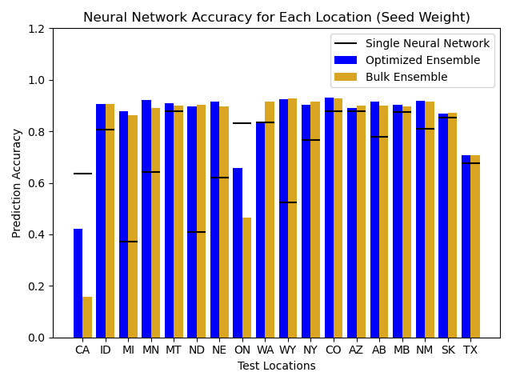

# Description

Hello! These scripts are for computing the accuracy of a range of different deep learning models on each environment of a CDBN dataset. 

The final output is a csv file, which can then be used to construct plots like this:



# Usage

First, you must set up a virtual environment called `venv` in a HPC setting which allows the submission of slurm jobs.
Inside this virtual environment you must install pytorch and sklearn packages.

The script is parallelised across slurm-jobs, and is started by `ensemble.sh`. For information on usage, type: `bash ensemble.sh --help`.

To get the complete dataset, you will need to do something like:

```bash
bash ensemble.sh -m mlp -s path/to/datset.csv -d path/to/destination1
bash ensemble.sh -m bagging -s path/to/dataset.csv -d path/to/destination2
```
(Note that whilst the scripts will create the destination directories if they do not exist, it is safer to create these directories manually first to avoid concurrency issues)

Doing this should submit 50 slurm jobs. Once they are all done, ensure that python and the scipy-stack are loaded by typing something along the lines of:
```bash
module load python scipy-stack
```

Then, you can combine the results using:

```bash
python combine_results.py path/to/destination1 path/to/destination2
```

This will create the file `path/to/destination2/combined_results.csv`, which contains all the information needed to create a plot like the one above.

